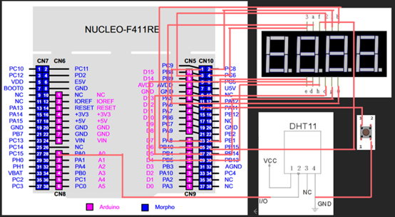

# 第二個專案

## 專案目標

* 使用STM32連結DTH11並透過按鈕切換在七段顯示器顯示結果

## 硬體架構

* 如果上圖看不懂可對照下方表格
* 限流電阻記得加

| STM_Pin | LED_Pin | 
|---------|:-------:|
| PC9     |  LED1   |
| PB8     |  LED2   |  
| PC8     |  LED3   |  
| PC6     |  LED4   | 
| PA8     |    A    |  
| PB10    |    B    |  
| PB4     |    C    |  
| PB5     |    D    | 
| PB1     |    E    | 
| PB15    |    F    |  
| PB14    |    G    |  
| PB13    |    H    |  

| STM_Pin | Button_Pin | 
|---------|:----------:|
| PA6     |    LED1    |

| STM_Pin | DHT11_Pin | 
|---------|:---------:|
| PA0     |    I/O    |

## 軟體架構

* 基於FreeRTOS
* 創建三個Task:DHT11,Button,LED_Display
* 使用全域變數讀取DHT11數值
* 使用全域變數紀錄按鈕狀態
* 根據按鈕狀態顯示DHT11數值
  * 在此之中顯示數值花我最多時間
  * 一方面處理閃爍問題；人的視覺暫留大約在20Hz，分到四位數之後要達到20Hz*2^4=0.003125s的更新速度，我設定4ms
  * 一方面處理顯示方式；此方法可以顯示0.001~9999，如超過9999只會顯示後四位數，如小於0.001顯示0，如1234.5678顯示1234.，如123.456顯示123.4
