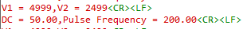

# PWM output

* System Clock = 32 MHz
* Prescaler = 32-1
  * Prescaler = 31
* ARR = 1000
  * ARR = 999
* Pulse = 500 - 1
  * Pulse = 499
* n_clock = System Clock/Prescaler+1
  * n_clock = 32/32 = 1MHz
* clock_t = n_clock/ARR + 1
  * clock_t = n_clock/ARR = 1kHz
* duty_Cycle = Pulse + 1/ARR + 1
  * duty_Cycle = Pulse/ARR * 100% = 50%
## 實驗一:驗證頻率是否為10kHz，DC是否為整數
* System Clock = 32 MHz
* Prescaler = 31
* ARR = 99
* Pulse = 0,10,20,30,40,50,60,70,80,90
* 掛LA顯示其結果

* Pulse 不用減一